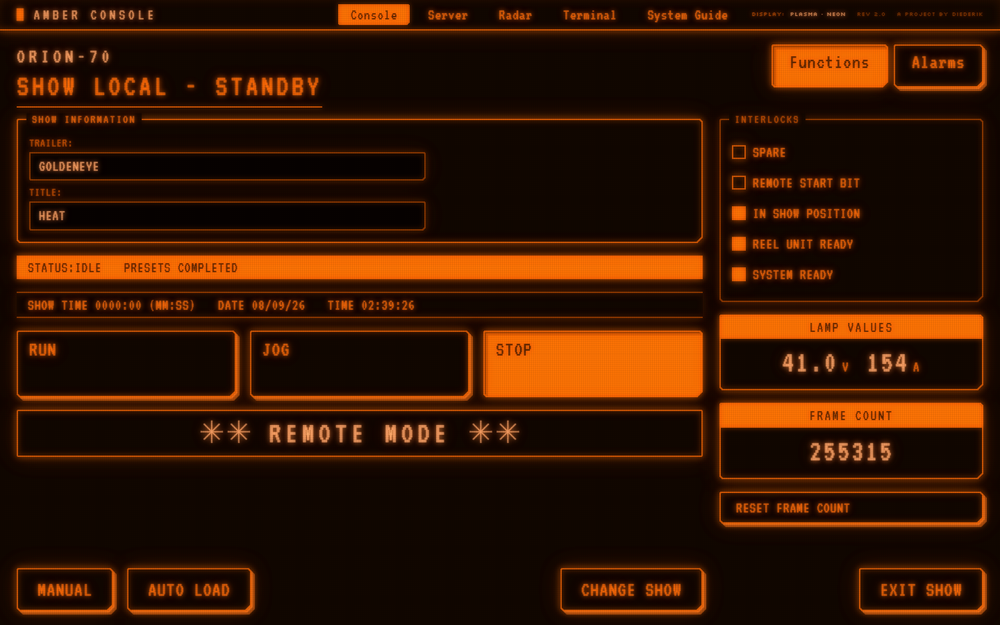

# Amber Console

A project by <a href="https://diederik.blog" target="_blank" rel="noopener noreferrer">Diederik</a>, also on <a href="https://x.com/DutchDiederik" target="_blank" rel="noopener noreferrer">X</a>.

[](LICENSE)
[](#install)
[](#install)
[](https://github.com/DutchDiederik/AmberConsole/actions/workflows/ci.yml)

A monochrome amber-terminal CSS framework — the look of a late-1980s industrial control panel, the
kind of amber plasma display that drove heavy machinery. One stylesheet, no dependencies, no build
step, no JavaScript required for any component's appearance.

**[Live demo — ORION-70 console](https://dutchdiederik.github.io/AmberConsole/docs/index.html) · [D-STAR server dashboard](https://dutchdiederik.github.io/AmberConsole/docs/server.html) · [SEASCAN radar](https://dutchdiederik.github.io/AmberConsole/docs/radar.html) · [TELEMARK terminal](https://dutchdiederik.github.io/AmberConsole/docs/terminal.html) · [System guide](https://dutchdiederik.github.io/AmberConsole/docs/guide.html)**



Every rule in this framework descends from a hardware limitation rather than a taste preference. The
panel could only light amber pixels, so hierarchy comes from brightness, inverse video and blink —
never hue. Text sat on a character grid, so spacing is measured in 4px half-cells. Regions were drawn
with strokes, so borders do the layout work and elevation does not exist. That constraint set is the
whole design; see [the six laws](#the-six-laws).

---

## Install

**A `<link>` tag is the entire install.**

```html
<link rel="stylesheet" href="amber-console.css">
```

Download [`dist/amber-console.css`](dist/amber-console.css) and the [`fonts/`](fonts/) directory,
keeping them as siblings — the `@font-face` rules use `../fonts/`. Or:

```bash
npm install amber-console
```

```js
import "amber-console";          // dist/amber-console.css
import "amber-console/layer";    // wrapped in @layer amber-console
```

### Which build

| File | Use it when |
| --- | --- |
| `dist/amber-console.css` | Default. Readable, sourcemapped, custom properties intact. |
| `dist/amber-console.min.css` | Production. 53kb, 9.4kb gzipped, same behavior. |
| `dist/amber-console.layer.css` | Dropping into an existing app — `@layer` makes the framework lose specificity fights against your own rules. Use *instead of*, never alongside. |
| `dist/amber-console.layer.min.css` | The same, minified. Production embedding. |
| `dist/amber-console.js` | Optional **behavior**, ES module. For bundlers. |
| `dist/amber-console.global.js` | Optional behavior, classic script. Needed for `file://` pages, where `type="module"` is blocked. |
| `dist/amber-console.effects.js` | Optional **persistence**, ES module. Ghosting, scroll smear, framebuffer decay. |
| `dist/amber-console.effects.global.js` | The same, classic script. |

### The two tiers

**The CSS is the framework. Both JS modules are optional, and they are optional
*separately*.** Neither imports the other; either works alone; the stylesheet works with neither.

| | CSS only | `+ effects.js` |
| --- | --- | --- |
| Every component, all 11 palettes | █ | █ |
| Decay-out — things that disappear drain instead of switching off | █ | █ |
| **De-energizing afterimage** — a lamp goes out, its glow lingers for the phosphor's full tail | █ | █ |
| Blink off-edge, scaled per emitter (long phosphors throb rather than chop) | █ | █ |
| Residual patches — the glass never sits perfectly uniform | █ | █ |
| **Page-to-page persistence** — the old screen decays behind the new one, per pixel | █ *(one-line opt-in)* | █ |
| PPI radar sweep with a decaying wake | █ | █ |
| **A lit area shrinking** — a falling bargraph trails behind its own edge | █ | █ *(uniform fade too)* |
| **Ghosting** — rewritten text leaves its previous value behind | ▯ | █ |
| **Scroll smear** — scaled by real scroll velocity | ▯ | █ |
| **Framebuffer decay on state change** — tab switch, dialog | ▯ | █ |

The three in the bottom group are not withheld — they are genuinely not expressible in CSS. Nothing
in the cascade remembers the old string; scroll **velocity** is not derivable from a scroll timeline,
which only exposes position; and `document.startViewTransition` is the only API that hands you a
snapshot of the screen you just replaced.

```html
<!-- CSS only. Complete. -->
<link rel="stylesheet" href="dist/amber-console.css">

<!-- add behavior (tabs, dialogs, presets) and/or persistence, in either order -->
<script src="dist/amber-console.global.js"></script>
<script src="dist/amber-console.effects.global.js"></script>
```

Page-to-page persistence needs one line in *your* stylesheet, because `@view-transition` is a
document-level switch that cannot be scoped to a selector — linking a stylesheet must not silently
rewrite how your site navigates:

```css
@view-transition { navigation: auto; }
```

Custom properties survive into `dist/` unresolved — they are the public API, so you can override any
of them at runtime without rebuilding.

## Quickstart

```html
<link rel="stylesheet" href="dist/amber-console.css">

<div class="ac-screen ac-bloom ac-crt ac-afterglow">
  <span class="ac-mesh"></span>
  <span class="ac-retrace"></span>
  <span class="ac-persist"></span>
  <nav class="ac-nav ac-nav--sticky">…</nav>   <!-- inside the frame, so the sims reach it -->
  <div class="ac-screen__body">
    <div class="ac-panel">
      <span class="ac-panel__title">Show Information</span>
      <div class="ac-statusbar" role="status"><span>STATUS:AUTO MODE</span></div>
      <button class="ac-btn ac-btn--filled">Run</button>
    </div>
  </div>
</div>
```

That renders a framed, glowing, scanlined control panel. No build step, no server — save it as a
`.html` file and double-click it.

**Or start from [`starter.html`](starter.html)** in this repo: the same thing as a real file, with a
panel, buttons, a working no-JS toggle, a meter and an alarm already on it, commented line by line and
with three things to try at the bottom. Download the repo, double-click it, start deleting.

## Class reference

### Layout

| Class | What it is | Modifiers |
| --- | --- | --- |
| `.ac-screen` | Full-height frame that hosts the simulations | — |
| `.ac-screen__body` | Padded content area inside it | override `--ac-screen-pad` |
| `.ac-stack` | Flex column, `gap` from `--ac-gap` | — |
| `.ac-row` | Flex row, `gap` from `--ac-gap` | `--wrap` `--center` `--baseline` `--between` `--end` |
| `.ac-grid` | Grid, columns from `--ac-cols` | `--console` (operate left / instrument right) |
| `.ac-col-2/3/4/6` | Column span | — |
| `.ac-spacer` `.ac-grow` `.ac-push` | Fill, absorb, push-to-end | — |
| `.ac-sr-only` | Available to assistive tech, invisible | — |

### Controls

| Class | What it is | Modifiers | Required markup |
| --- | --- | --- | --- |
| `.ac-btn` | Soft key | `--filled` `--dim` `--lg` `--sm` `--pad` `--block` | `<button>`, `<a>` or `<input type="submit">` |
| `.ac-tabs` / `.ac-tab` | Soft-key tabs, Title Case | `.ac-tab--active` | `role="tablist"` > `role="tab"` + `aria-selected` |
| `.ac-nav` | Screen menu bar | `--sticky` | `__mark` `__links` `__link` (`--active`) `__meta`; `aria-current="page"` |
| `.ac-setup` | Permanently-open control board under the bar. Never opens, closes, scrolls or sticks | — | `__grid` (quarters) + `__foot`; regions are `.ac-panel` |
| `.ac-check` | Status bit — fills solid, no ✓ glyph | `--disabled` | `<label>` > `<input type="checkbox">` + `<span>` |
| `.ac-radio` | Exclusive mode | `--disabled` | `<label>` > `<input type="radio">` + `<span>` |
| `.ac-toggle` | Two-position switch with mandatory ON/OFF text | `--on` `--input` (CSS-only) | `__track` > `__thumb`, plus `__state` |
| `.ac-field` / `.ac-input` | Labeled recessed well | `--block` `--invalid` | `<label>` > `__label` + `<input>` |
| `.ac-select` | `.ac-input` plus a typeset ▼ | `--block` | `<span class="ac-select">` > `<select class="ac-input">` |
| `.ac-keypad` | 3-column numeric entry grid | `__key` `__key--fn` `__key--wide` `--dense` | keys are `.ac-btn` |

### Display

| Class | What it is | Modifiers | Required markup |
| --- | --- | --- | --- |
| `.ac-panel` | Framed region | `--dim` `--bar` | `__title` (legend chip) or `__barTitle` (inverse strip) |
| `.ac-statusbar` | The machine's voice, inverse video | `--line` | `role="status"` |
| `.ac-readout` | Instrument value | `--lg` `--inline` | `__label` (`--plain`) + `__value` + `__unit` |
| `.ac-badge` | Micro tag, Silkscreen at 8px | `--filled` `--dim` | — |
| `.ac-banner` | Loudest element. One per screen | `--filled` `--dim` | `role="alert"`; ✳✳ auto-injected |
| `.ac-table` | Data grid | `--zebra` `--dense`, `__num`, `__row--active` | wrap in `.ac-table-scroll` |
| `.ac-list` | Keyed log with leader dots | `--bright` `--dim` `--dense` | `<dl>` > `__item` > `__key` + `__fill` + `__value` |
| `.ac-meter` | Stepped bargraph | `--lg` `--dim` `--alarm` | `__track` (set `--ac-meter-value`) > `__bar`; `__scale` |
| `.ac-dialog` | Modal | `--wide` | native `<dialog>`; `__title` `__body` `__actions` |
| `.ac-spinner` | Character spinner \| / — \\ | `--lg` `--dim` | `role="status"` |
| `.ac-hr` | 2px divider | `--bright` | `<hr>` |

### Effects

| Class | What it is |
| --- | --- |
| `.ac-blink` | Hard `steps(1)` on/off, 1.1s. Never a fade — `.ac-afterglow` softens the OFF edge only. |
| `.ac-cursor` | Trailing block cursor |
| `.ac-bloom` | PLASMA: amplified glow tokens, a soft bleed layer breathing on a 9s mains cycle, and the cell mesh — a crossed wire grid on a 3px pitch, so a lit pixel is a neon dot at a wire intersection rather than part of a solid stroke. Buzzes sub-pixel on two detuned cycles. Needs an `.ac-mesh` child. |
| `.ac-crt` | CRT: scanlines, vignette, one-cell drift per 11s, ±2% flicker. Needs a `.ac-retrace` child. |
| `.ac-afterglow` | PERSISTENCE: things that disappear decay instead of switching off, a de-energized control's glow lingers for the emitter's full tail, and the glass holds faint uneven patches. With `effects.js` it also ghosts rewritten text and smears while scrolling. Needs an `.ac-persist` child. |
| `.ac-sweep` | PPI radar face — a rotating `conic-gradient` whose angular falloff *is* the decaying wake. Pure CSS, no script. Period scales off `--ac-persist-tail`. Needs an `.ac-sweep__beam` child. |
| `.ac-scanlines` | Static, motion-free line texture, for print and thumbnails |
| `.ac-classic` | The default look, stated explicitly: corners cut instead of arced on every bordered surface inside it, keys on a hard offset edge, labels top-left. See below. |
| `.ac-rounded` | The way back to the smooth 8px arc, at any scope. Same rules, original values. |

Put these on the outermost frame, once per screen, never nested. They should be operator-toggleable
in a real product — the demos show how, putting `.ac-afterglow` on the CRT switch rather than a third
one, since persistence belongs to the same glass the scanlines are on.

**`.ac-bloom` and `.ac-crt` are mutually exclusive.** They are not two layers of glass, they are two
display technologies, and no panel is both: a frame carrying both has gas gaps and a scanning beam in
the same enclosure, wearing a cell mesh and raster blanking gaps at once. A screen door is not a
scanline, and there is no scan in a plasma panel to blank. `amber-console.js` enforces this —
switching either one on switches the other off, and both toggles move to prove it — but **nothing in
the CSS stops you**, so if you are authoring the frame by hand, pick one. Both off is allowed and is
a real thing to want: a flat lit surface, no particular hardware. `.ac-afterglow` is not a third
technology but what the phosphor does after the beam has gone, so it belongs with `.ac-crt`.

A DISPLAY preset must therefore name at most one of them in `data-ac-sims`; listing both leaves
whichever is applied last, which is not a useful thing to have asked for.

**The demos default to PLASMA on and CRT off**, and the markup they ship matches that state rather
than the everything-on state above. Plasma is what the panel *is* — a matrix of gas gaps — so it is
on. CRT simulates a different display technology, and its horizontal blanking gaps are the one thing
a plasma panel conspicuously does not have; shipping both meant the first impression was a plasma
screen wearing a tube's scanlines. It stays one click away, and the choice persists to
`localStorage` under `ac.sim.plasma` / `ac.sim.crt`. Defaults live per-simulation in the `SIMS` map
in `amber-console.js`. Note that `.ac-afterglow` rides the CRT switch, so it is off by default too.

Anything off by default must be **absent from your static markup**, or it paints for one frame on
every load before the script removes it. The overlay children are mounted and removed with their
switch.

On a full-screen frame (`.ac-screen`) the bleed, scanline mask, vignette and retrace anchor to the
**viewport**, not the document. They are properties of the glass, and glass does not scroll — a
document-anchored vignette darkens the top and bottom of the page instead of the edges of the
screen, and a `backdrop-filter` stretched over a 15,000px document bands into visible tile seams.
Small tiles carrying `.ac-bloom` or `.ac-crt` are unaffected and stay local.

**The frame is the whole screen, menu bar included.** Put `.ac-nav` *inside* it. The overlays paint
from z-index 40 up, above `.ac-nav--sticky` at 20, so a sticky bar is part of the panel rather than
a flat strip floating over it. `.ac-screen` clips with `overflow: clip` rather than `hidden`
specifically so that works: `hidden` makes the frame a scroll container, and `position: sticky`
inside a scroll container that never scrolls does not stick.

### Classic buttons

An 8px quarter-circle is a thing a modern rasterizer does. A gas-discharge panel addressing a coarse
cell grid could not — it cut the corner off — and the keys on one stood on a hard offset edge with the
label parked in the top-left corner and the body left empty for a value. **That is the default look**,
because it is what the hardware was. The smooth corner is still fully supported; it is now the thing
you opt into.

```html
<!-- classic is the default; these are the ways to say otherwise -->
<div class="ac-rounded">…</div>            <!-- one region back to the arc -->
<div class="ac-classic">…</div>            <!-- one region back to the cut -->
<html data-ac-style-classic="off">         <!-- the whole page — what the demo switch writes -->
```

All three are the same rules reading the same tokens, and they nest in either direction — a classic
island inside a rounded region is a supported arrangement, not a specificity coin toss.

**The corner reaches every bordered surface** in scope — buttons, tabs, panels, dialogs, inputs, nav
links, toggle tracks, meter tracks — because a beveled key inside a rounded panel reads as two display
generations on one screen. Two other things reach **only the controls**:

- **The extruded edge** (`--ac-edge-3d`). A drop shadow claims the thing stands off the glass, which is
  true of a soft key and a switch housing and of nothing else on the board. It is an *edge*, not a
  ghost: an outer `box-shadow` is clipped to outside the border box, so a hard offset copy paints a
  solid band down the bottom and right rather than a floating duplicate. Two layers give it depth — a
  bright 2px lip against the stroke, then 3px more falling away.
- **The top-left label.** A soft key is a label plus room for a value, so it is parked in the corner;
  centering it says the key is a word rather than a field. This is `.ac-btn--pad`'s alignment without
  its 96px min-height, so it applies at whatever size a key happens to be and composes with `--pad`
  unchanged. Keypad digits are exempt — one character has no label/value split to serve.

**The four corners are not cut the same, and that is the 3D reading rather than a decoration.** These
keys were drawn as solid objects lit from the top left, so the far corner is barely cut and the near
one is cut hardest: `2 / 4 / 8 / 4` px in TL TR BR BL order, with `--ac-radius-sm` running the same
diagonal at half depth for wells and switch housings. Cut all four alike and the key reads as an
octagon instead of an object. The extrusion is offset along that same diagonal — one claim about where
the light is, made twice.

A filled or `aria-pressed` key is **pressed in: the band flips to the top and left**, because the near
face of a sunken key is the upper one. The key itself does not move — a `translate` reads correctly but
contributes to scrollable overflow, so a latched key flush against its container pushed 4px past it
(caught on an `.ac-grow` pad and the keypad's `Ent`). A box-shadow is ink overflow and costs nothing
either way, so the light moves and the geometry does not. A `disabled` key keeps neither edge nor halo.

**Two corner paths, and the fallback is not a degradation.** Where `corner-shape` is supported the
radius is spent on the cut. Where it is not (Firefox, older Safari) it quantizes to a hard 2px
instead, which is the same statement — a corner the cell grid can hold — made in a property every
engine has had for fifteen years. The extrusion and the top-left label are identical on both paths, so
what Firefox loses is the chamfer and nothing else.

`clip-path` and `mask-image` could cut a genuine stair-step and were both rejected: they clip the
element's entire painting, `--ac-glow-box` included, so a stepped corner would be bought by deleting the
discharge halo off all four sides. `border-radius` and `corner-shape` reshape the shadow instead of
removing it, which is the only reason this is written in them.

Everything above lives in `src/components/classic.css`. The three scopes set nothing but custom
properties, and every rule is written once and reads its values out of the cascade — so adding a fourth
scope, or a per-region override, is a token block and nothing else.

### Persistence

A cell or a phosphor that stops being driven relaxes rather than switching off.

**Persistence and flicker are one number read in two directions.** A phosphor has a decay constant;
a screen redraws every frame. What is *left* of the previous frame when the next one arrives is the
persistence — the smear. What is *missing* is the modulation depth — the flicker. So a screen cannot
be steady and smear-free at once, and every historical fitting decision falls out of that trade: P11
is fully dark between frames (no persistence, maximum flicker, which is why it was a phosphor for
screens meant to be *photographed*), and P39 is still at 91% (no flicker at any refresh rate, paid
for in smear, which is why it went on radar). The derivation computes both from one decay constant
for exactly that reason — the same way `--ac-halo-spread` is the square root of `--ac-halo-scatter` and
cannot disagree with it.

Palettes that know their own decay declare it, and the timing tokens are **derived from that**:

| Token | Default | What it times |
| --- | --- | --- |
| `--ac-persist` | `105ms` | The emitter's own visible decay. Set per palette; everything below comes off it |
| `--ac-flicker` | `1` | How much of the image is gone by the next refresh, 0–1. Scales flicker amplitude only |
| `--ac-decay` | `min(--ac-persist, 250ms)` | Elements that disappear, and explicit ghosts |
| `--ac-decay-fast` | `min(--ac-persist, 60ms)` | Rewritten text, and de-energizing controls — where a full tail would smear |
| `--ac-persist-tail` | `--ac-persist` | Ghosts and residual patches. **Uncapped** — where the long phosphors are allowed to be long |
| `--ac-decay-ease` | `cubic-bezier(0.1, 0.72, 0.22, 1)` | The relaxation curve: fast knee, long tail |

**The caps are a usability decision made against the physics on purpose.** P7's tail is 3000 ms and
P39's is 2000 ms; those are correct, and a dialog that stays painted for two seconds after it closes
is a bug that can cite a source. So anything a user waits on is clamped, and the decorative layers —
ghosts, residual patches — run at full length, which is where the effect actually lives. `min()` also
gets the short phosphors right in the other direction for free: P11 declares `0.035ms`, so its UI
snaps rather than decaying.

Long-persistence phosphors do not decay exponentially — they follow a Becquerel power law, a fast
knee over a very long tail, which no single `cubic-bezier` expresses. Those palettes ship a
`linear()` easing **sampled from the decay model itself**, on a log-spaced grid so the resolution
sits where the curvature is. Older engines fall back to the bezier.

The four gas palettes deliberately declare none of this. No decay figure for these panels is cited
yet, and inventing one to fill the column is exactly the kind of number this system refuses — so they
fall back to the defaults above and render identically to before.

It also covers the two light-off events you actually hit most:

- **De-energizing** — a lamp going out. A pressed button releasing, a tab deselecting, an interlock
  unchecking. These never hide, so decay-out never sees them. The control's *structure* — background,
  border, text color — releases on `--ac-decay-fast` so it reads as off immediately, while its
  **halo** decays on the uncapped `--ac-persist-tail`, because the halo is precisely the scattered
  light that persists. Under P39 a released button glows for a second and a half.
- **The blink OFF edge** — `.ac-blink`, `.ac-cursor`, an invalid `.ac-input`, an over-range
  `.ac-meter--alarm` bar. One rule swaps `animation-name`, so each keeps its own cycle length. Long
  phosphors get a second keyframe entirely: the next ON edge lands before the previous one has
  drained, so the alarm *throbs* rather than chops, and never reaches the dark half at all.
- **Scroll smear** — scrolling hands every cell a new value at once, so the image trails. Scaled by
  real scroll speed, drained when you stop, and skipped entirely under `prefers-reduced-motion`.
- **A lit area shrinking** — a bargraph does none of the above: the element stays, its text is
  elsewhere, its color never moves. What changes is its *width*, so the strip it vacates was lit a
  moment ago and is now simply not drawn. `.ac-meter` grows a second bar that lags behind the live one
  on `--ac-persist-tail`, and the asymmetry needs no rule of its own — on a fall the ghost is *wider*
  and its trailing strip drains; on a rise it is *narrower*, so it hides under the live bar and
  nothing fades in.

In every case the ON edge stays instant: a cell lights on the next refresh, and it is only the
switching off that hardware cannot do sharply. Nothing here fades *in*.

The CSS draws a **taper behind a receding edge**, which is what a *gradually* falling value genuinely
looks like — each cell stops being driven at a slightly different moment. A *sudden* drop stops every
vacated cell at once and should fade uniformly instead; CSS cannot hold the old width, so
`effects.js` recovers it and parks a proper uniform ghost. It does that generically, for any element
inside the frame whose lit area shrank, so your own widgets are covered without the framework knowing
they exist.

**Hover is deliberately excluded from the afterimage.** A pointer crossing a dense panel
de-energizes every control it touches, and at a two-second tail that leaves a wake of glowing boxes
behind the cursor — which reads as lag, not as phosphor. Hover keeps its instant change; the
afterimage answers only to real state.

Ghosting, the scroll smear and the framebuffer decay need
[`amber-console.effects.js`](#the-two-tiers) — nothing in the cascade remembers the old string.
A node that is *removed* has no rect left to pin a ghost to, so ghost it first:

```js
AmberConsoleEffects.afterglow(row);   // no-op when the simulation is off
row.remove();
```

To decay the whole screen across a change of your own, wrap it:

```js
AmberConsoleEffects.transition(() => {           // falls back to a plain call
  panel.replaceChildren(nextView);               // when the module or API is absent
});
```

Use it for **discrete** changes only — a tab switch, a dialog, a panel swap. A view transition
cancels whichever one is already running, so wrapping every text tick would mean a 3000 ms P7
snapshot being thrown away sixty times a second and never completing once. Frequent updates keep the
ghost mechanism, which composes instead of canceling.

This is the one place the framework uses a `transition`. It is hardware, not UI: nothing fades *in*,
and components stay instant redraws — `scripts/check-prohibitions.mjs` still enforces that.

## Driving state

State hooks are ARIA attributes first, with class aliases as equivalents. A framework that binds
`:aria-selected` needs no class juggling:

```html
<button class="ac-btn" aria-pressed="true">Run</button>     <!-- same as .ac-btn--filled -->
<button class="ac-tab" aria-selected="true">Functions</button>
<a class="ac-nav__link" aria-current="page">Console</a>
<input class="ac-input" aria-invalid="true">
```

`:checked` and `:disabled` do the rest. React, Vue, Svelte, Astro, HTMX, Rails, Django, PHP or a
plain `.html` file all drive this identically.

## The optional JavaScript

Two modules, both dependency-free, both **strictly optional**, and optional *separately* — neither
imports the other, and every component looks and reads correctly with both absent. See
[the two tiers](#the-two-tiers) for what each buys you.

### `amber-console.js` — behavior

1. the `role="tablist"` keyboard model (←/→/Home/End, roving tabindex)
2. flipping an `aria-pressed` toggle — the `.ac-toggle--input` variant needs no JS at all
3. the PLASMA and CRT simulation switches, persisted to `localStorage` — CRT carries the afterglow
4. opening and closing a `<dialog>`
5. the [display presets](#three-axes-and-they-are-not-the-same-axis), likewise persisted — the
   palettes themselves are pure CSS and switch on `data-ac-tech` + `data-ac-emitter`, which you can
   write into your own markup
6. the style flags, same deal on `data-ac-style-*`

### `amber-console.effects.js` — persistence

1. **ghosting** — rewritten text leaves its previous value behind
2. **scroll smear** — scaled by real scroll velocity
3. **framebuffer decay** — `transition(fn)`, a real snapshot of the screen you just replaced

It needs no handshake with the behavior module and no registration call: it watches the DOM for
`.ac-afterglow` on the frame and `data-ac-engine` on the root, because those facts are already *in*
the DOM. A contract between the two modules would be a thing to keep in sync; an observer is not.

**All three need the same two things, so there is one switch rather than three.** Each is scoped to
`.ac-afterglow`, which ships with the CRT simulation — there is no plasma equivalent, because a
plasma cell is driven continuously and has nothing that trails. And each is *timed* by
`--ac-persist`, so a phosphor whose tail is measured in microseconds gives them no time to be seen.
`data-ac-engine="css"` turns the module off entirely; the demo boards expose that as **JS Effects**,
and the control **reads OFF and goes unclickable wherever it would be a no-op** — under any plasma
simulation, and under any phosphor whose tail is shorter than **80 ms**. That rules out P11, P31 and
P4, whose tails are 0.035, 0.038 and 0.06 ms, and it rules out **P1 at 24 ms and P3 at 25 ms** as
well. It is live under P7 and P39 — 3000 and 2000 ms — and under a plasma gas if you switch the CRT
simulation on by hand, since the `:root` tail is 105 ms and the gate reads the frame rather than the
preset.

**80 ms is a perceptual floor, not a compositing one**, and the difference is the whole reason P1 and
P3 are on the dead side of it. A 25 ms tail is a frame and a half at 60 Hz: the module could draw a
ghost there, and it would be a single-frame flicker rather than a decay — `tokens/effects.css` has
always held that much under ~80 ms the eye stops reading a relaxation and starts reading a switch.
So the two most-picked phosphors were paying for cloning, measuring and mounting work whose result
nobody could see. The catalog has nothing between 25 and 105 ms, so the threshold is not near
anything. It is `ENGINE_FLOOR_MS` in `amber-console.js`, mirrored as `PERSIST_FLOOR_MS` in
`amber-console.effects.js` — the switch and the work it governs — and by `scripts/build.mjs`, which
uses it to decide whether a docs board ships the switch enabled.

Two details worth knowing if you drive this yourself. **The switch shows what is contributing, not
what the flag permits** — so it can read OFF while `data-ac-engine` is still `css+js`, because nothing
it governs can be seen on that panel. And **the flag is never rewritten to force that**: your
preference survives a trip through a palette where the effects are pointless and comes back when you
return to one where they are not.

> The scroll smear used to have a `data-ac-style-smear` flag of its own. It was removed: it could only
> ever be on under CRT, so it spent most of its life disabled and explaining why, which is a third
> axis of state for a preference nobody was expressing. It is now simply part of what this module
> does. `prefers-reduced-motion` still stops it, which was the only accessibility case the flag was
> actually carrying.

```html
<script src="dist/amber-console.global.js"></script>          <!-- classic; works from file:// -->
<script src="dist/amber-console.effects.global.js"></script>

<script type="module">
  import "./dist/amber-console.js";                            /* ES module, either order */
  import "./dist/amber-console.effects.js";
</script>
```

Both auto-initialize. Call `AmberConsole.init(scope)` again after rendering new markup, and
`AmberConsoleEffects.afterglow(el)` to ghost an element you are about to remove —
`AmberConsole.afterglow(el)` still works and forwards to it.

## Display: technology, then emitter

A palette here is not a theme and not a light/dark pair — it is a specific piece of hardware, and it
takes **two attributes** on the root element to name one, because the same color word means
different physics on different glass:

```html
<html data-ac-tech="plasma" data-ac-emitter="neon">   <!-- default; omit and you get this -->
<html data-ac-tech="crt"    data-ac-emitter="p3">
```

`data-ac-tech` is the **technology** — what is making light at all. `data-ac-emitter` is **which gas,
or which phosphor**, inside it. An emitter is only meaningful within its technology: `neon` is a gas
and exists only under plasma, `p3` is a phosphor and exists only under CRT. Every palette block is
selected by *both*, so a mismatched pair selects nothing rather than quietly rendering the wrong
hardware.

| tech | emitter | CIE x,y | reads as | what it is |
| --- | --- | --- | --- | --- |
| **`plasma`** *(default)* | **`neon`** | 0.631, 0.369 | orange-red | A monochrome AC plasma panel. Neon emitting directly from the gas — no phosphor anywhere in the stack. This is what the six laws describe and what `.ac-bloom` simulates. |
| `plasma` | `helium` | 0.394, 0.299 | pale pink | No manifold dominates — helium's visible lines all fall out of n=3 and n=4 decaying to n=2 at comparable energies. The 587.6 nm yellow carries the luminance; 447.1 and 667.8 nm pull it off the blackbody locus toward purple. |
| `plasma` | `argon` | 0.216, 0.105 | pale violet-lavender | Most of argon's output is past 700 nm where the eye scores under 0.01, so its 696.5 nm peak is the strongest line but not the color. What you see is the 415–475 nm group. Also why argon is **dim**. |
| `plasma` | `krypton` | 0.315, 0.255 | pale violet-white | A blue-violet cluster at 427–450 nm against the 557.0 nm green and the 587.1 nm yellow. Spread that wide integrates close to white. |
| **`crt`** | **`p3`** | 0.523, 0.469 | amber | The classic amber CRT phosphor: a broad ~590 nm band with real green content. A *different* display technology — a beam exciting a phosphor, which emits and then persists — but it is what most people mean by "amber terminal", it is the ramp the source design system was drawn against, and it pairs with `.ac-crt`. |
| `crt` | `p1` | 0.215, 0.711 | willemite green | Zn₂SiO₄:Mn, the oldest CRT phosphor and the one the early scopes and radar indicators were built around. A silicate, so a narrow 48 nm band against the sulfides' 76–130. Medium persistence. |
| `crt` | `p4` | 0.270, 0.300 | white | The television phosphor, and a **blend**: ZnS:Ag blue mixed with a yellow emitter in one coating, integrating to white. Two powders mixed have one color — which is what separates it from P7. |
| `crt` | `p7` | 0.138, 0.150 **/** 0.355, 0.537 | blue flash over yellow-green | **Two coatings, in sequence.** The beam writes in blue ZnS:Ag; that layer's own photons pump a long yellow-green (Zn,Cd)S:Cu layer behind it. Ink is blue, halo is green, and the trail outlives the flash by seconds. The radar phosphor — see law 1. |
| `crt` | `p11` | 0.138, 0.150 | blue | A photographic-recording phosphor: blue is where film is most sensitive, so P11 was fitted to screens meant to be photographed rather than watched. Decays in tens of microseconds, so it flickers hardest of anything here. |
| `crt` | `p31` | 0.208, 0.530 | green | ZnS:Cu — the green everybody pictures when they picture a terminal or a lab oscilloscope. The highest luminous efficiency here, sitting near the peak of the photopic curve. |
| `crt` | `p39` | 0.225, 0.696 | yellow-green, long | P1's willemite with arsenic added, which lengthens the decay by orders of magnitude and leaves the color alone. No visible flicker at any refresh rate, paid for in smear. |

Nine of the eleven palettes are **computed, not picked**. `scripts/derive-gas.mjs` integrates a cited
spectrum against the CIE 1931 2° observer, maps the result into sRGB, and solves each of the five
stops to its contrast target; `npm test` re-derives them and fails on drift. The data, its source and
the per-emitter selection rule are in
[`scripts/data/emitters.json`](scripts/data/emitters.json).

Neon and P3 stay hand-built. Neon is in the line table anyway as the pipeline's **known-answer
gate** — it derives to x=0.6405 y=0.3591 against the x=0.631 y=0.369 established independently years
earlier, agreeing to 0.0137, and if that ever stops being true the build fails there rather than
silently shipping wrong palettes.

**Two palettes share a ramp with another and that is not a bug.** P1 and P39 are both Zn₂SiO₄:Mn and
differ only in decay; P7's flash and P11 are both ZnS:Ag and differ only in what sits behind them.
Where the compound is the same the color is the same, and the palettes are told apart by their
persistence rather than their hue. The derivation found this on its own — P1 and P39 were fitted from
different published coordinates and converged on the same band.

> **The phosphors carry a weaker claim than the gases, and it is not hedging to say so.** A gas emits
> lines and NIST publishes them, so those palettes run *spectrum → color* from measured data. No
> comparable public table of phosphor band **shapes** exists; what is published is the resulting
> chromaticity. The phosphor blocks therefore run backwards — *published color → band* — and their
> bands are back-solved rather than measured, which makes their `validate` gate a consistency check
> rather than the independent known-answer gate neon provides. The `$phosphors` block in
> `emitters.json` states this plainly, along with the four things that are nonetheless non-circular
> about the result. Persistence figures are **provisional** pending a per-phosphor data-sheet
> citation; the persistence *class* is solid and is all the design depends on.

> **Deprecated:** `data-ac-gas="neon"` and `data-ac-gas="amber"` still work and will be removed in
> 3.0. The name was the bug — `amber` was never a gas, it is a CRT phosphor, and calling it one is
> exactly the confusion the pair above exists to prevent. `data-ac-gas-toggle` likewise still works
> but can only ever reach those two palettes; migrate to `[data-ac-display]` radios.

The neon hue is derived rather than picked. Weighting the Ne I visible lines by the CIE 1931
observer puts the discharge at x=0.631 y=0.369 — just outside sRGB, gamut-mapping to 19°. That is a
*DC* neon tube; this panel's sustain is a short high-field pulse, which enriches the 585.2 nm line
against the 640 nm red group and walks the hue up. 19–31° is the defensible band; 24° is its middle.

Every stop is solved to a **contrast ratio**, never re-tinted — rotating hue at constant lightness
drops `--ac-emit-50` to 2.79:1 and silently fails the 3:1 non-text gate. `npm run contrast` runs the
[full pair table](#accessibility) against **every** palette independently; a ratio that passes under
one and fails under another is a build failure.

Adding an emitter — or a whole technology — means adding one block to `src/tokens/colors.css` and
nothing else: the five discharge stops, three surfaces, `--ac-on-fill`, the four `--ac-halo-N` glow
triples, and the two scattering scalars. Everything else in the system is an alias or is built from
those.

**The gases do not all glow the same, and that is physics rather than styling.** Rayleigh scattering
goes as λ⁻⁴, so a violet gas throws far more of itself sideways into the glass than a red one does.
`--ac-halo-scatter` is that ratio against neon — helium 1.26, krypton 1.31, argon 1.49 — and
`--ac-halo-spread` is its square root, since multiple scattering widens the halo as it brightens it.
`effects.css` applies them to the outer glow layers only: the innermost 2px is the glyph's own lit
edge, not scattered light. A palette that declares neither falls back to 1 and renders exactly as
before.

Not modeled, deliberately: the eye's longitudinal chromatic aberration, which genuinely makes violet
sources look fuzzier and ratios out at 2.67× for argon. The absolute difference behind that ratio is
0.126 dioptres — under one pixel at any normal viewing distance — so scaling a bloom radius by it
would inflate a sub-pixel effect into a hundred and fifty pixels of fog.

### Three axes, and they are not the same axis

The demo pages carry a **setup board** (`.ac-setup`) that separates the four things it is easy to
conflate. It never opens, closes or scrolls — every switch the panel has is on the glass at once,
which is affordable only because the emitter catalog is split by technology across two of the four
quarters rather than stacked into one tall list:

| axis | question it answers | where it lives | how many |
| --- | --- | --- | --- |
| **Display** | which hardware is in the panel | `data-ac-tech` + `data-ac-emitter` on the root | exactly one |
| **Simulation** | what the glass does about it — bloom, scanlines, persistence | classes on the frame, via `data-ac-sim` | any combination |
| **Style** | a look the viewer chose, not what the panel is — comfort, typography, corners | `data-ac-style-*` on the root | any combination |
| **Engine** | how much of the library is running | `data-ac-engine` on the root | `css` or `css+js` |

Engine is the odd one and is on the board for a reason: almost everything above is CSS, and there is
no way to *see* that from a page where every effect is on at once. `data-ac-engine="css"` puts the
three effects that need `amber-console.effects.js` — ghosting, scroll smear, framebuffer decay — dark
and leaves the rest running, which answers "what does the JavaScript buy me" better than a paragraph
can. A `<button data-ac-engine>` toggles it; the default is `css+js`, and the effects module reads
the attribute off the root itself.

Note what it is *not*. It makes no claim about the hardware, so it is not a simulation, and it is not
a comfort preference, so it is not a style — which is also why flipping it does not put the readout
into `*MOD`.

Simulation, style and engine share the board's third quarter as one **Switches** region rather than
one panel each: three regions of switches ran 606px against 342px for the catalog beside them, on a
board whose contents have to be short enough never to scroll. The boundary the three borders were
drawing is drawn by group labels inside the one region instead, because it does still have to be
drawn — a flat list of four switches would say Plasma and JS Effects are the same sort of thing.

Display sets color and simulation never does. A **preset** is a display row that also names the
simulations its technology implies:

```html
<input type="radio" name="ac-display" data-ac-display
       data-ac-tech="crt" data-ac-emitter="p3" data-ac-sims="crt">
```

Selecting it switches the palette to the P3 phosphor, mounts `.ac-crt`, and switches every *other*
known simulation off — one click, and the `.ac-toggle` for each moves to prove it. `data-ac-sims` is
a space-separated list; simulations this build does not have are ignored rather than throwing.

A preset is a starting point, not a lock. Flip a simulation or a style afterwards and the readout
says `*MOD`; nothing is prevented. `[data-ac-display-reset]` puts the preset's simulations back, and
`[data-ac-display-out="label|tech|emitter|peak|mode"]` gives you somewhere to show the state.

`peak` comes from `data-ac-peak` on the catalog row, and it is **not the same kind of number on both
sides of the catalog.** A gas emits a *line spectrum*, so its number is the strongest visible line —
which is not the perceived hue, that being the CIE integral of every line at once (the argument
`colors.css` makes for landing neon at 24° rather than at its 585.2 nm line). Argon reads violet on
the glass while its strongest visible line is deep red at 696.5 nm, and most of what argon emits is
not visible at all. A phosphor emits a *broad band*, so its number is the band peak, and that one
does correspond to the hue. Two phosphors carry two numbers because they are two emitters: P4 is a
blend, P7 is two layers.

`[data-ac-display-info]` shows one node and hides the rest, so the board can carry a note describing
whatever is currently in the panel. A key is a technology (`crt`) or an exact palette (`crt/p3`);
exact wins where one exists, so a phosphor that does not behave like the rest of its family can say
so without every other phosphor needing its own paragraph. The prose is markup, like the catalog.

**The catalog is markup, not a table inside the JavaScript** — write your own `[data-ac-display]`
rows for your own palettes and the module needs no edit. All of it is optional: the palettes are pure
CSS, so you can set `data-ac-tech` and `data-ac-emitter` in your own markup and never load the
module.

## Tokens

Override any of these; see [what you may safely change](#theming).

```
                  plasma/neon  plasma/helium  plasma/argon  plasma/krypton  crt/p3
--ac-screen          #100600      #0e0809        #0b0812       #0b080b         #0d0700
--ac-screen-raised   #1b0c02      #1b1214        #171222       #181318         #170e02
--ac-screen-well     #060200      #060404        #050309       #050405         #060200

--ac-emit-100        #ffa86d      #ffa2b9        #c9b0ff       #eaa5eb         #ffd052   hot highlight, focus
--ac-emit-90         #ff6b08      #dc7d96        #af81ff       #bf86c0         #ffae1e   primary discharge
--ac-emit-70         #dd5800      #bc6a80        #9f5dff       #a372a3         #cd8817   secondary
--ac-emit-50         #ab4500      #925163        #8925f1       #7f587f         #8d5b10   dim, disabled
--ac-emit-30         #5b2500      #502a34        #4b1088       #442e45         #4a2f08   trace, ghost
--ac-on-fill         #1e0c00      #201216        #1b112c       #1b141b         #1a0e00

--ac-halo-1 … --ac-halo-4 bare "r, g, b" triples the glow is built from
--ac-halo-scatter     how much of this emitter reaches the halo, vs neon at 1.00
--ac-halo-spread      sqrt of it; scales the halo radii

--ac-ink --ac-ink-bright --ac-ink-dim --ac-ink-faint --ac-ink-trace
--ac-fill --ac-fill-bright
--ac-stroke --ac-stroke-dim

--ac-font-terminal "VT323", "Courier New", ui-monospace, monospace
--ac-font-micro    "Silkscreen", "VT323", ui-monospace, monospace
--ac-type-display 44px  --ac-type-title 30px  --ac-type-body 22px  --ac-type-small 18px  --ac-type-micro 8px
--ac-tracking-display .1em  --ac-tracking-body .04em  --ac-tracking-micro .08em  --ac-leading 1.15

--ac-space-1 4px … --ac-space-12 48px      --ac-border-w 2px
--ac-radius 8px   --ac-radius-sm 4px       (0–2px on strips and badges)

--ac-glow-text  --ac-glow-box
--ac-edge-3d    2px+5px hard offset · the extruded key edge, the one shadow that is not a halo

--ac-mesh-pitch 3px   --ac-mesh-wire 0.075   (the cell matrix; see the note below)
```

`--ac-mesh-wire` is a **budget, not a taste setting.** Two crossed 1px wires lose a mean
`1 - (1 - a/3)²` of everything under them, and `0.075` is the value that lands that at `0.050` —
exactly the mean loss of the CRT scanlines it sits beside. `scripts/contrast.mjs` computes from
`colors.css` and cannot see an overlay, so nothing will fail if you raise it. Redo the arithmetic
first.

The ramp is `--ac-emit-100` through `--ac-emit-30`. It was `--amber-*` until 2.0: that named a hue rather
than a ramp, and was already only historically true — under the default palette the color is neon,
not amber. With a lavender and a pink in the file it stopped being defensible at all.
**`--amber-*` was removed in 2.0**, along with every other pre-prefix name. It was briefly kept as a
read alias, which turned out to be worse than nothing: the framework never read it, so setting it did
nothing and warned about nothing. Use `--ac-emit-*`.

Component-level hooks: `--ac-gap`, `--ac-cols`, `--ac-screen-pad`, `--ac-panel-title-bg`,
`--ac-meter-value`, `--ac-backdrop`.

**`--ac-ink-faint` and `--ac-ink-dim` never glow.** Glow is the signal of energization; a disabled control
that glows is a lie about the hardware. Inverse video does not glow either — dark text on a lit block
is the *unlit* part of that block.

**The halo is inherited, not requested.** `reset.css` and `.ac-screen` apply `text-shadow:
var(--ac-glow-text)` once and it inherits to everything, because the glow is light scattered in the
glass and the glass has no idea which component a lit cell belongs to. So **wherever you set an ink
level, restate the halo that belongs to it**:

```css
color: var(--ac-ink);        text-shadow: var(--ac-glow-text);         /* emit-90, full drive */
color: var(--ac-ink-bright); text-shadow: var(--ac-glow-text);
color: var(--ac-ink-dim);    text-shadow: var(--ac-glow-text-dim);     /* emit-70, 0.70 */
color: var(--ac-ink-faint);  text-shadow: var(--ac-glow-text-faint);   /* emit-50, 0.41 */
color: var(--ac-on-fill);    text-shadow: none;                     /* unlit, inside a lit block */

.thing:disabled { text-shadow: none; box-shadow: none; }         /* inert — never glows */
```

**Glow follows the drive level, not the token's name.** `--ac-ink-dim` is `--ac-emit-70`, which
`derive-gas.mjs` labels *secondary* — a cell driven at 70%, which scatters 70% as much. It is not an
off state. The only things that go completely flat are genuinely **inert**: a disabled control, and
the unlit text inside an inverse-video block. The tiers are arithmetic rather than taste — each
stop's luminance is already fixed by the contrast ratio it was solved to, so 1.00 / 0.70 / 0.41 fall
straight out of 7.0 / 5.2 / 3.4 : 1, and `--ac-emit-30` lands at 0.11, which is why decorative rules
stay flat. **Radius never scales, only alpha** — how far light spreads is a property of the glass and
the wavelength, not of the drive.

**Strokes glow too.** A 2px rule in `--ac-stroke` is the same value as `--ac-ink`, so it is the same lit
phosphor and carries the same halo — `box-shadow: var(--ac-glow-box)`, or `var(--ac-glow-box-dim)` for
`--ac-stroke-dim`. This has to be stated per component, because unlike `text-shadow`, `box-shadow` does
not inherit. Watch for the case where they disagree: an `.ac-input` is bright text inside a dim box.

Inheritance alone is not enough in either direction, which is why the pairing is the rule rather than
"just let it inherit": an element that *brightens* its own color inside dim prose inherits the dim's
suppression and stays flat, and an element that dims its own color keeps a halo it never asked for.
`npm run check` enforces the pairing **and its direction** — a lit level with the halo off fails just
as loudly as a lit level with no halo stated at all.

## The six laws

1. **One emitter, many intensities.** There is no phosphor in a monochrome plasma panel — the light
   is the gas emitting directly. Hierarchy is brightness, inverse video and blink — never hue. There
   is no red, no green, no "success" color. The law is **per palette**, and always was: a screen
   shows one emitter's ramp and nothing else. Which emitter — neon's orange-red, argon's lavender,
   P3's amber — is a choice of hardware, not a second hue on the panel.

   **Unless the hardware is literally two emitters, and then the second appears only in the decay.**
   P7 is a blue ZnS:Ag coating over a yellow-green (Zn,Cd)S:Cu one: the beam writes in blue, the blue
   layer's own photons pump the layer beneath it, and what the screen *holds* is yellow-green. Blue
   ink inside a green halo is not a second hue smuggled in as decoration — it is the only thing that
   tube can honestly look like. The limits are what keep this from swallowing the law: the second
   emitter is **never** semantic (it cannot mean success, danger or state), no component may select
   on it, and only the *first* emitter is ever `--ac-ink` — so the ramp under the contrast gate is still
   one emitter's, solved to the same ratios as every other palette. If a palette wants a second hue
   and cannot name the coating that produces it, it does not get one.
2. **Inverse video is importance.** A solid amber block with dark text is the machine speaking.
   Ration it: two or three per screen.
3. **Everything is a box.** 2px rules draw the regions. No elevation, no shadows-as-depth.
4. **The character grid rules.** Labels are `KEY:VALUE`, leading is 1.15, space is 4px half-cells.
5. **Casing is semantic.** System text is ALL CAPS; operator soft keys are Title Case. That split
   carries information.
6. **Ornament is typographic.** Emphasis is repeated glyphs: `✳✳ REMOTE MODE ✳✳`. Never an SVG icon
   set, emoji, illustration, or imagery of any kind. The icon system is
   `✳ █ ▮ ▯ ▲ ▼ ◄ ►` and box-drawing characters, typeset in the terminal font.

There is no logo and no icon set, and this is intentional — the genre predates GUI icon systems.
Render product names in plain letter-spaced type.

`npm run check` enforces the mechanical parts of this: no second hue, no `<svg>`, no emoji, no
`border-radius` above 8px, no `transition` in components, no third font.

## Fonts

Two bitmap faces, both SIL Open Font License 1.1, vendored in `fonts/`:

- **VT323** — everything at 18px and up (`--ac-font-terminal`)
- **Silkscreen** — 8–10px micro labels only (`--ac-font-micro`)

**Regular weight only.** There is no bold in this system — hierarchy is size, intensity and inverse
video, never weight — so no bold face is fetched or shipped. Five `@font-face` rules, 54kb of woff2
total, and a `<strong>` inside a component gets the same synthetic bold it would get from VT323,
which has no 700 either.

**VT323 must never render below 18px.** It is a bitmap face and turns to mud. There is no 12px or
14px in this system; below 18px, use Silkscreen at 8–10px.

These are **era-correct substitutes, not the original face.** The source hardware used a mask-ROM
bitmap font with no digital release; VT323 is a digitization of the DEC VT320 terminal ROM. If you
have a licensed face closer to the hardware, it is a one-line swap — replace `--ac-font-terminal` and
nothing else.

Prefer not to vendor the binaries? Swap `tokens/fonts.css` for `tokens/fonts-cdn.css` in
`src/amber-console.css` and rebuild. Note the trade-off: offline and `file://` pages then fall back
to Courier New, which loses the bitmap grid the whole effect depends on.

The ornament glyphs (`✳ █ ▼` …) fall outside the subsetted webfonts' `unicode-range` and render from
the system font. This matches the upstream Google Fonts behavior and is what the design was drawn
against.

## Accessibility

Ratios below are **computed** from the tokens by `npm run contrast`, not estimated — and the
gate runs against **every palette**, so none of them ships untested.

#### `data-ac-tech="plasma" data-ac-emitter="neon"`

| Foreground | Background | Ratio | Needs | Verdict | Use |
| --- | --- | --- | --- | --- | --- |
| `--ac-ink` | `--ac-screen` | 7.02:1 | 4.5:1 | **AA** | Body text on the panel |
| `--ac-ink-bright` | `--ac-screen` | 10.57:1 | 4.5:1 | **AA** | Live values, hover, input text |
| `--ac-ink-dim` | `--ac-screen` | 5.22:1 | 4.5:1 | **AA** | Field labels, legends, secondary text |
| `--ac-ink-faint` | `--ac-screen` | 3.42:1 | 4.5:1 | fails — exempt | Disabled text — decorative only |
| `--ac-ink-trace` | `--ac-screen` | 1.63:1 | 4.5:1 | fails — exempt | Row separators, leader dots — non-text |
| `--ac-on-fill` | `--ac-fill` | 6.64:1 | 4.5:1 | **AA** | Inverse video: dark text on amber |
| `--ac-on-fill` | `--ac-fill-bright` | 10.00:1 | 4.5:1 | **AA** | Inverse video, hover state |
| `--ac-ink-bright` | `--ac-screen-well` | 10.89:1 | 4.5:1 | **AA** | Input text in a recessed well |
| `--ac-ink-faint` | `--ac-screen-well` | 3.52:1 | 4.5:1 | fails — exempt | Placeholder text |
| `--ac-ink` | `--ac-screen-raised` | 6.69:1 | 4.5:1 | **AA** | Body text on a zebra table row |
| `--ac-stroke` | `--ac-screen` | 7.02:1 | 3:1 | **AA (non-text)** | 2px borders — non-text, needs 3:1 |
| `--ac-stroke-dim` | `--ac-screen` | 3.42:1 | 3:1 | **AA (non-text)** | Dim borders — non-text, needs 3:1 |

#### `data-ac-tech="crt" data-ac-emitter="p3"`

| Foreground | Background | Ratio | Needs | Verdict | Use |
| --- | --- | --- | --- | --- | --- |
| `--ac-ink` | `--ac-screen` | 10.81:1 | 4.5:1 | **AA** | Body text on the panel |
| `--ac-ink-bright` | `--ac-screen` | 13.74:1 | 4.5:1 | **AA** | Live values, hover, input text |
| `--ac-ink-dim` | `--ac-screen` | 6.81:1 | 4.5:1 | **AA** | Field labels, legends, secondary text |
| `--ac-ink-faint` | `--ac-screen` | 3.47:1 | 4.5:1 | fails — exempt | Disabled text — decorative only |
| `--ac-ink-trace` | `--ac-screen` | 1.62:1 | 4.5:1 | fails — exempt | Row separators, leader dots — non-text |
| `--ac-on-fill` | `--ac-fill` | 10.23:1 | 4.5:1 | **AA** | Inverse video: dark text on amber |
| `--ac-on-fill` | `--ac-fill-bright` | 13.01:1 | 4.5:1 | **AA** | Inverse video, hover state |
| `--ac-ink-bright` | `--ac-screen-well` | 14.16:1 | 4.5:1 | **AA** | Input text in a recessed well |
| `--ac-ink-faint` | `--ac-screen-well` | 3.58:1 | 4.5:1 | fails — exempt | Placeholder text |
| `--ac-ink` | `--ac-screen-raised` | 10.29:1 | 4.5:1 | **AA** | Body text on a zebra table row |
| `--ac-stroke` | `--ac-screen` | 10.81:1 | 3:1 | **AA (non-text)** | 2px borders — non-text, needs 3:1 |
| `--ac-stroke-dim` | `--ac-screen` | 3.47:1 | 3:1 | **AA (non-text)** | Dim borders — non-text, needs 3:1 |

#### `data-ac-tech="plasma" data-ac-emitter="helium"`

| Foreground | Background | Ratio | Needs | Verdict | Use |
| --- | --- | --- | --- | --- | --- |
| `--ac-ink` | `--ac-screen` | 7.01:1 | 4.5:1 | **AA** | Body text on the panel |
| `--ac-ink-bright` | `--ac-screen` | 10.52:1 | 4.5:1 | **AA** | Live values, hover, input text |
| `--ac-ink-dim` | `--ac-screen` | 5.21:1 | 4.5:1 | **AA** | Field labels, legends, secondary text |
| `--ac-ink-faint` | `--ac-screen` | 3.39:1 | 4.5:1 | fails — exempt | Disabled text — decorative only |
| `--ac-ink-trace` | `--ac-screen` | 1.63:1 | 4.5:1 | fails — exempt | Row separators, leader dots — non-text |
| `--ac-on-fill` | `--ac-fill` | 6.40:1 | 4.5:1 | **AA** | Inverse video: dark text on amber |
| `--ac-on-fill` | `--ac-fill-bright` | 9.59:1 | 4.5:1 | **AA** | Inverse video, hover state |
| `--ac-ink-bright` | `--ac-screen-well` | 10.83:1 | 4.5:1 | **AA** | Input text in a recessed well |
| `--ac-ink-faint` | `--ac-screen-well` | 3.49:1 | 4.5:1 | fails — exempt | Placeholder text |
| `--ac-ink` | `--ac-screen-raised` | 6.49:1 | 4.5:1 | **AA** | Body text on a zebra table row |
| `--ac-stroke` | `--ac-screen` | 7.01:1 | 3:1 | **AA (non-text)** | 2px borders — non-text, needs 3:1 |
| `--ac-stroke-dim` | `--ac-screen` | 3.39:1 | 3:1 | **AA (non-text)** | Dim borders — non-text, needs 3:1 |

#### `data-ac-tech="plasma" data-ac-emitter="argon"`

| Foreground | Background | Ratio | Needs | Verdict | Use |
| --- | --- | --- | --- | --- | --- |
| `--ac-ink` | `--ac-screen` | 7.00:1 | 4.5:1 | **AA** | Body text on the panel |
| `--ac-ink-bright` | `--ac-screen` | 10.53:1 | 4.5:1 | **AA** | Live values, hover, input text |
| `--ac-ink-dim` | `--ac-screen` | 5.18:1 | 4.5:1 | **AA** | Field labels, legends, secondary text |
| `--ac-ink-faint` | `--ac-screen` | 3.40:1 | 4.5:1 | fails — exempt | Disabled text — decorative only |
| `--ac-ink-trace` | `--ac-screen` | 1.63:1 | 4.5:1 | fails — exempt | Row separators, leader dots — non-text |
| `--ac-on-fill` | `--ac-fill` | 6.37:1 | 4.5:1 | **AA** | Inverse video: dark text on amber |
| `--ac-on-fill` | `--ac-fill-bright` | 9.58:1 | 4.5:1 | **AA** | Inverse video, hover state |
| `--ac-ink-bright` | `--ac-screen-well` | 10.88:1 | 4.5:1 | **AA** | Input text in a recessed well |
| `--ac-ink-faint` | `--ac-screen-well` | 3.52:1 | 4.5:1 | fails — exempt | Placeholder text |
| `--ac-ink` | `--ac-screen-raised` | 6.46:1 | 4.5:1 | **AA** | Body text on a zebra table row |
| `--ac-stroke` | `--ac-screen` | 7.00:1 | 3:1 | **AA (non-text)** | 2px borders — non-text, needs 3:1 |
| `--ac-stroke-dim` | `--ac-screen` | 3.40:1 | 3:1 | **AA (non-text)** | Dim borders — non-text, needs 3:1 |

#### `data-ac-tech="plasma" data-ac-emitter="krypton"`

| Foreground | Background | Ratio | Needs | Verdict | Use |
| --- | --- | --- | --- | --- | --- |
| `--ac-ink` | `--ac-screen` | 7.01:1 | 4.5:1 | **AA** | Body text on the panel |
| `--ac-ink-bright` | `--ac-screen` | 10.51:1 | 4.5:1 | **AA** | Live values, hover, input text |
| `--ac-ink-dim` | `--ac-screen` | 5.21:1 | 4.5:1 | **AA** | Field labels, legends, secondary text |
| `--ac-ink-faint` | `--ac-screen` | 3.42:1 | 4.5:1 | fails — exempt | Disabled text — decorative only |
| `--ac-ink-trace` | `--ac-screen` | 1.63:1 | 4.5:1 | fails — exempt | Row separators, leader dots — non-text |
| `--ac-on-fill` | `--ac-fill` | 6.35:1 | 4.5:1 | **AA** | Inverse video: dark text on amber |
| `--ac-on-fill` | `--ac-fill-bright` | 9.53:1 | 4.5:1 | **AA** | Inverse video, hover state |
| `--ac-ink-bright` | `--ac-screen-well` | 10.80:1 | 4.5:1 | **AA** | Input text in a recessed well |
| `--ac-ink-faint` | `--ac-screen-well` | 3.51:1 | 4.5:1 | fails — exempt | Placeholder text |
| `--ac-ink` | `--ac-screen-raised` | 6.45:1 | 4.5:1 | **AA** | Body text on a zebra table row |
| `--ac-stroke` | `--ac-screen` | 7.01:1 | 3:1 | **AA (non-text)** | 2px borders — non-text, needs 3:1 |
| `--ac-stroke-dim` | `--ac-screen` | 3.42:1 | 3:1 | **AA (non-text)** | Dim borders — non-text, needs 3:1 |

### Known constraints

- **`.ac-btn--sm` computes to roughly 30px tall.** WCAG 2.2 Target Size (Minimum, 2.5.8, AA) asks for
  24×24 CSS px and the widely-used practical floor is 44px — so this clears the spec minimum and
  misses the comfortable one. The value is fixed by the source design system, so it is documented
  rather than changed.
  **Safe:** dense mouse-driven tooling — a log filter, a table's row actions, an admin settings row.
  **Unsafe:** anything on a touch panel, and any *primary* action anywhere — use the default
  `.ac-btn`, which is 44px for exactly this reason.
  If you need small *and* touch-safe, keep `--sm` for the look and extend the hit area to 44px with
  padding or a pseudo-element, without changing the drawn box.
- Checkbox, radio and toggle keep their drawn sizes (20px squares, a 64×28 track) but their **labels**
  carry `min-height: 44px` so the clickable area clears the floor. Bit-field rows are therefore taller
  than in the original design.
- `.ac-banner` steps down from 44px to 30px type below 480px. At display size a two-word banner has a
  min-content width near 400px and would otherwise be clipped on a phone.

## Theming

**You may override:** the five amber intensities (to retune the gas), the three surface blacks,
spacing, the two radii, glow strength, and any component-level custom property.

**You must not override:** the hue (one gas — a second hue breaks law 1), the type sizes (the
18px floor is a property of the bitmap face, not a preference), or the 2px stroke.

Embedding in an existing app? Use `dist/amber-console.layer.css` and swap `base/reset.css` for
`base/reset-scoped.css`, then wrap your markup in `.ac-root` so the framework never repaints the
host page's `body`.

## Not for you if…

This is a **genre** framework, not a neutral one. It will fight any product that wants a modern,
brand-flexible UI. If you need more than one hue, an icon set, a light mode, subtle transitions,
small type, or a design your marketing team can re-skin — use something else. Amber Console is for
dashboards, status boards, terminal tools, control surfaces, game UIs, and anything that should look
like it runs machinery.

## Browser support

Current Chromium, Firefox and Safari. Everything load-bearing is plain CSS — no nesting syntax, no
`@container`, and `:has()` only as a progressive-enhancement alias for an explicit class.

`backdrop-filter` (the plasma bleed layer) degrades gracefully: where it is unsupported the bloom
simply does less rather than breaking, because the amplified glow tokens do most of the work.

## Development

No install is needed for the main workflow — the build is pure Node.

```bash
npm test           # check + contrast + build — the whole zero-dependency gate
npm run build      # -> dist/, zero dependencies
npm run dev        # build + watch + serve docs/ at :4173 (--port to move it)
npm run check      # the prohibitions gate
npm run contrast   # recompute the contrast table (--md for the README format)
```

Two gates need the optional dev dependencies (`npm i`):

```bash
npm run lint         # stylelint: ac- BEM pattern, no transitions in components
npm run test:visual  # playwright: 14 captures across widths, a11y modes and print
```

`npm run fonts` re-downloads the webfonts and regenerates `src/tokens/fonts.css`.

`npm run assets` re-renders the favicon, the touch icon and the social card. They are not drawn —
they are the letter A and the console demo rendered through `dist/amber-console.css` itself, so
retuning the gas retunes the icon. The favicon is a PNG rather than the usual inline SVG on purpose:
`npm run check` bans `<svg>` in HTML, and law 6 does not make an exception for browser chrome.

See [CONTRIBUTING.md](CONTRIBUTING.md).

## Provenance

**The design system is the project; the console is only its demo.** Amber Console is a set of tokens
and component classes for the industrial-control-panel genre. ORION-70 — the fictional projector
console in `docs/index.html` — exists to exercise every class in one screen, and nothing in the
framework depends on it.

D-STAR, the self-hosted server dashboard in `docs/server.html`, is the second demo and argues the
other half: that these tokens dress an ordinary modern application — tab views, a table of services
you can start and stop, a destructive action that confirms — rather than only reproducing period
hardware. It is invented on exactly the same terms as ORION-70.

SEASCAN RM-12, the marine radar in `docs/radar.html`, is the third, and it exists for a single
emitter. P7 is two coatings — a blue flash the beam writes and a yellow-green layer behind it that
holds for three seconds — and there is exactly one instrument that was built around that behavior.
The other demos can show you the color of a phosphor; this one shows what the color is *for*.

TELEMARK 400, the market data terminal in `docs/terminal.html`, is the fourth and argues about
density: roughly four hundred numbers on one screen, and every one of them legible. Its contributing
banks are invented alongside it, because a real institution's four-letter code is exactly the kind of
borrowed authority this section exists to refuse.

The genre was studied from period projection-booth hardware, and the debt is
[acknowledged below](#acknowledgements). All four demos are invented: their names, their wordmarks
and their copy are ours, and no manufacturer's branding, wordmark or logo appears anywhere in this
repository or in the published package. Where a demo echoes the layout conventions of real equipment,
that is the genre being reproduced rather than any one product — the same way a terminal emulator is
not the VT320.

The values in `src/tokens/` came from an internal design bundle that is not published with this
repository. The deviations from it, and the discrepancies resolved along the way, are recorded in
[CHANGELOG.md](CHANGELOG.md).

## License

BSD 3-Clause License — see [LICENSE](LICENSE). The bundled webfonts are SIL OFL 1.1; see `fonts/OFL-*.txt`.

### TL;DR
- Free to use, modify, and share this code freely in any way you want in private or commercial projects, as long as you keep my copyright notice and the license text.
- Don’t use my name to promote your project.
- The software comes with no guarantees, so use it at your own risk.
- If this has been proven useful or if this helped you make a bunch of money, feel free to <a href="https://buymeacoffee.com/dutchdiederik" target="_blank" rel="noopener noreferrer">buy me a coffee</a>. 

## Acknowledgements

Inspired by the 1970s user interface of an IMAX projector. Thanks to
<a href="https://x.com/RealJessePalmer" target="_blank" rel="noopener noreferrer">@RealJessePalmer</a> and
<a href="https://x.com/uncledoomer" target="_blank" rel="noopener noreferrer">@uncledoomer</a> for talking about it
on X — that sparked this idea.
